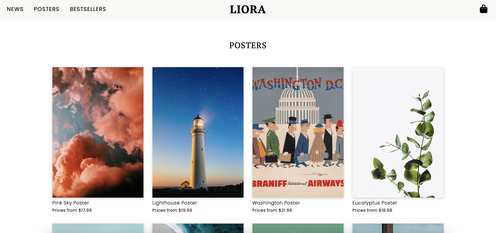
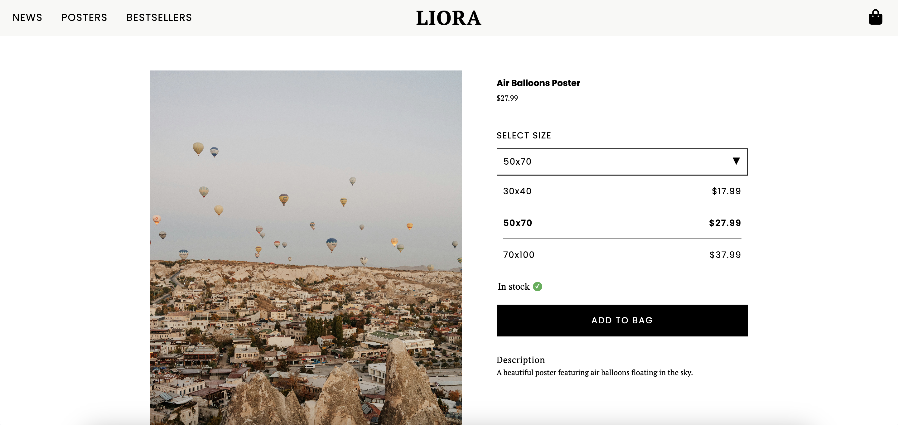
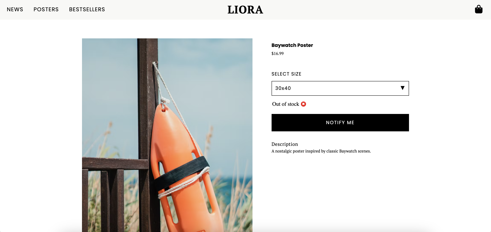
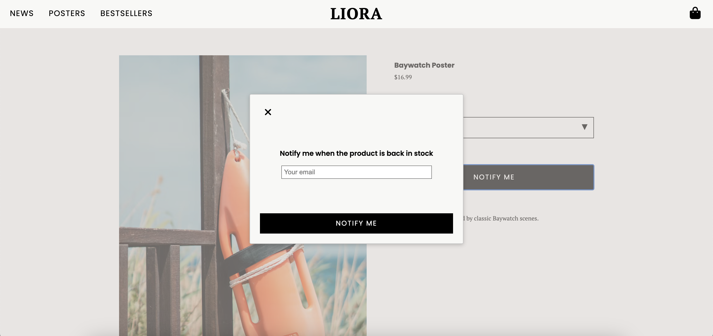
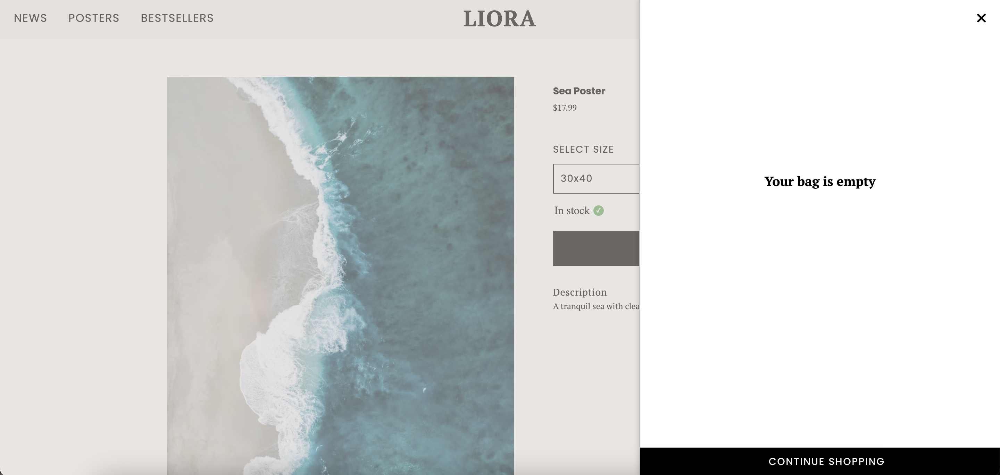
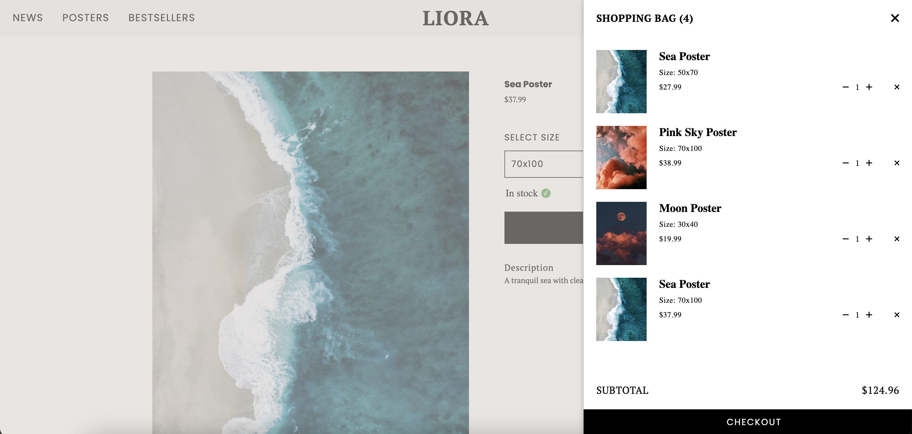
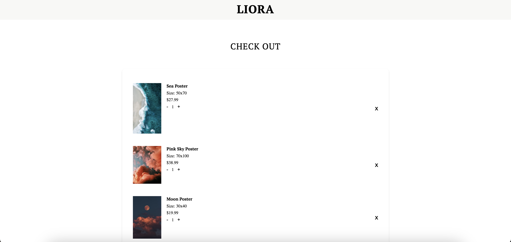
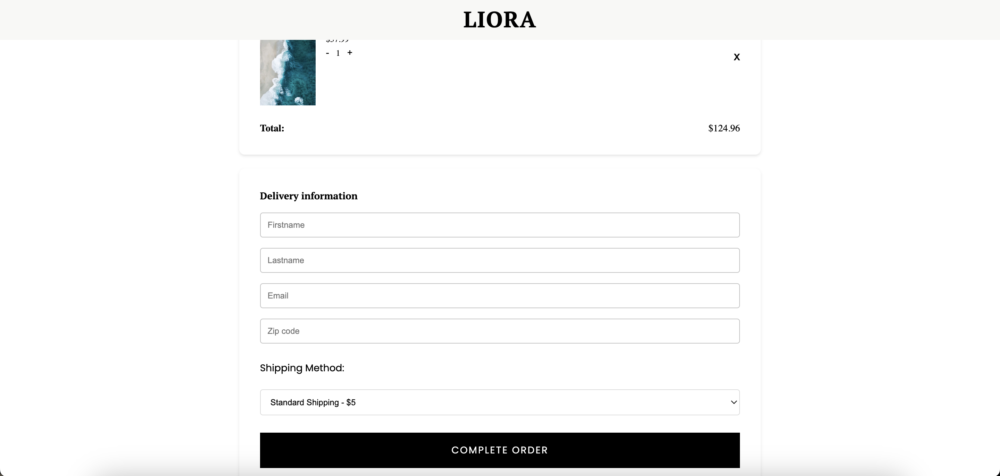
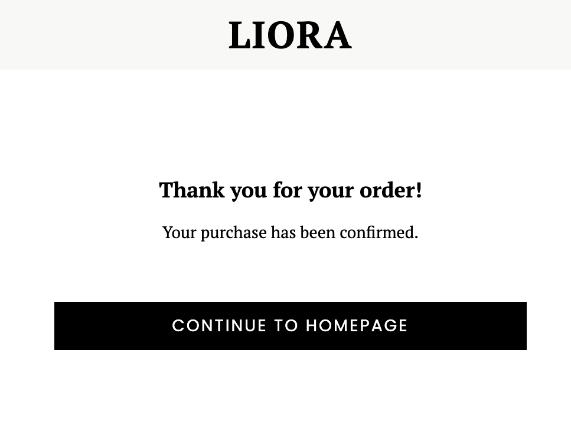
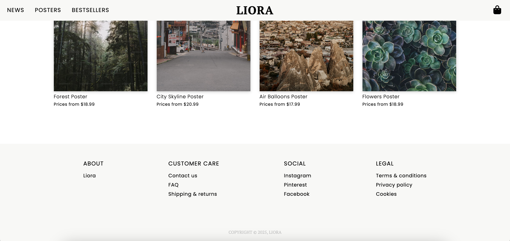

# Liora Webshop 
A poster webshop built with [Vite](https://vite.dev/) and together with two classmates. 

## Technique

- HTML
- SCSS
- TypeScript

## Requirements

- A landing page (homepage)
- A product page (product details)
- A checkout page
- A shopping cart
- Ability to add products to the shopping cart
- Simulate completing a purchase on the checkout page
- Calculate the total price of the products in the shopping cart
- Ensure that information in the shopping cart is stored using extended objects, not just one product
- Ability to increase/decrease the number of products in the shopping cart
- Ability to increase/decrease the number of products on the checkout page

## Extra
- Show whether a product is in stock or not
- Simulate a notify function when a product is back in stock


## Working Method 
This project has been driven as an agile development project, such as:
* Daily standups 
* Sprint planning
* Backlog 
* Retrospective

## DEMO 
### Homepage


### PLP


### PDP



### Out of stock - notify message



### Shopping Cart
 <p>
    
    
  </p>

### Check out 
 <p>
    
    
  </p>

### Thank you message 


### Footer



## Installation 

### 1. Clone this repository
```
https://github.com/malinjansson/LioraWebshop.git
```

### 2. Navigate to the project folder
```
cd LioraWebshop
```

### 3. Install dependencies
```
npm install
```

### 4. Run the application
```
npm run dev
```
The application will be available at local: http://localhost:5173/


